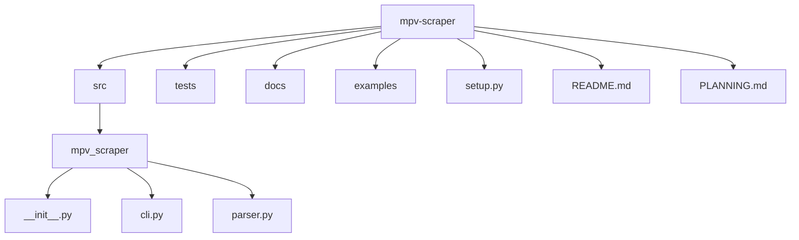

# MPV Metadata Scraper for Knulli UI

## 1. Project Overview
Build a CLI tool that automatically scrapes TV show and movie metadata (titles, descriptions, dates, ratings, artwork) from TVDB (for TV) and TMDB (for movies) and generates EmulationStation-compatible `gamelist.xml` files (with accompanying images) for the `/mpv` folder in Knulli UI.

## 2. Goals
- **Automate** metadata gathering so the MPV video library in Knulli is richly populated.
- **Standardize** file naming, XML structure, and asset storage under `/mpv`.
- **Optimize** images (PNG, <600 KB) for fast loading on handheld.
- **Guide** the user interactively when ambiguous matches arise.

## 3. Project Structure
The project follows a standard `src` layout to ensure clean imports and a clear separation between the application code and project configuration.



## 4. Scope
- **In scope (MVP)**
  - TV shows under `/mpv/<Show Name>/`
  - Movies under `/mpv/Movies/`
  - One-level directory scanning
  - TVDB for TV metadata, TMDB for movies
  - Generating `/mpv/gamelist.xml` and `/mpv/<Show Name>/gamelist.xml` (and `/mpv/Movies/gamelist.xml`)
  - Downloading poster/thumbnails/logos, converting to PNG, resizing if needed
  - Interactive CLI prompts for ambiguous titles (choices are for the current session only).
  - **Anthology span support**: handle filenames with episode ranges (e.g., `S01E09-E10`), name spans in output and fetch metadata from the first episode in the range, falling back to subsequent episodes if fields (image, desc) are missing.
- **Out of scope (future)**
  - Additional metadata sources (e.g. fan art, subtitles)
  - Multi-language support
  - Season-folder nesting beyond one level
  - Persistent storage of user disambiguation choices.

## 5. Tech Stack
- **Language:** Python 3.9+
- **Key libraries:**
  - `requests` (HTTP)
  - `Pillow` (image processing)
  - `xml.etree.ElementTree` or `lxml` (XML)
  - `click` (CLI)

## 6. Directory & Output Structure
```text
/mpv
  ├ gamelist.xml
  ├ images/
  │   └ <show_images>.png
  ├ Movies/
  │   ├ gamelist.xml
  │   └ images/
  │       └ <movie_posters>.png
  ├ <Show A>/
  │   ├ gamelist.xml
  │   └ images/
  │       └ <episode_images>.png
  └ <Show B>/ …
```

## 7. Data Sources & APIs
- **TVDB** (v4): search series, fetch episodes, artwork
- **TMDB** (v3): search movie by title+year, fetch poster, overview, release_date, vote_average

## 8. Key Requirements
- **Filename parsing**
  - TV: `Show Name - S01E01 - Episode Title.mp4`, `Show Name - S01E09-E10 - Title A & Title B.mp4`
  - Movies: `Movie Title (Year).mp4`
- **Metadata fields**
  - `<path>`, `<name>`, `<desc>`, `<image>`, `<thumbnail>` (optional), `<marquee>` (logo), `<rating>`, `<releasedate>`
- **Anthology (span) behavior**
  - Recognize `SxxExx–Eyy` ranges in filenames
  - Output `<name>` using the full span (e.g. `Title A & Title B – S01E09-E10`)
  - Fetch metadata (desc, image) for the first episode in the span; if missing, try the next episode, etc.
- **Image handling**
  - Convert all art to PNG
  - Resize/compress under 600 KB
- **Interactive prompts** for ambiguous matches (e.g. “Danger Mouse”)
- **Graceful failure** on missing data or API errors

## 9. Timeline & Milestones
- **Sprint 1:** Directory scanning & Filename parsing
- **Sprint 2:** TVDB integration
- **Sprint 3:** TMDB integration
- **Sprint 4:** Image processing
- **Sprint 5:** XML Generation & CLI Integration
- **Sprint 6:** Testing, validation, documentation, and polishing
- **Sprint 7:** Undo & Rollback Functionality
