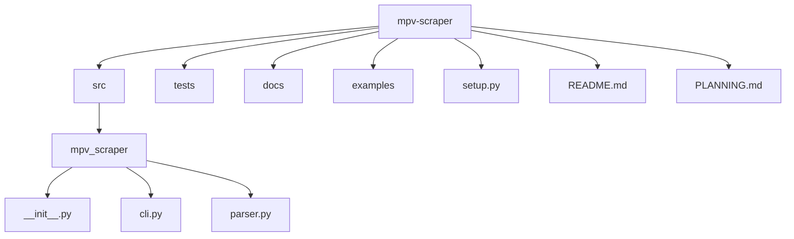

# MPV Metadata Scraper

A command-line tool to automatically scrape metadata for TV shows and movies and generate EmulationStation-compatible `gamelist.xml` files for the Knulli UI.

## Overview

This tool scans a target directory (e.g., `/mpv`) containing TV show and movie media files, fetches metadata from online databases, downloads artwork, and generates the necessary `gamelist.xml` files for a rich media experience in frontends like EmulationStation.

It's designed to work with the Knulli UI's expected directory structure, ensuring that all media is correctly cataloged with titles, descriptions, ratings, release dates, and artwork.

## Project Structure
The project follows a standard `src` layout to ensure clean imports and a clear separation between the application code and project configuration.



## Key Features

- **TV & Movie Scraping:** Uses TheTVDB for television series and TheMovieDB for movies.
- **`gamelist.xml` Generation:** Creates EmulationStation-compatible `gamelist.xml` files for the root media folder and each subdirectory.
- **Smart Filename Parsing:** Robustly parses filenames for both TV shows (`Show - S01E01 - Title.ext`) and movies (`Movie (Year).ext`).
- **Anthology Span Support:** Correctly handles TV episode ranges (e.g., `S01E09-E10`), combining metadata and titles appropriately.
- **Image Processing:** Downloads artwork, converts it to PNG, automatically resizes/compresses to stay under 600 KB (max 500 px width) for fast loading.
- **Interactive Mode:** Prompts the user to resolve ambiguities when multiple search results are found. The user's choice is for the current session only and is not saved.
- **API Key Management:** Loads API keys securely from environment variables.

## Tech Stack

- **Language:** Python 3.9+
- **CLI Framework:** Click
- **Core Libraries:**
  - `requests` for API communication
  - `Pillow` for image processing
  - `lxml` for XML generation

## Target Directory Structure

The scraper expects and generates the following structure within the main media folder (e.g., `/mpv`):

```
/mpv
├── gamelist.xml              # Top-level gamelist with <folder> entries for shows/movies
├── Movies/
│   ├── gamelist.xml          # Gamelist for all movies
│   ├── Movie Title (Year).mp4
│   └── images/
│       └── Movie Title (Year).png
└── <Show Name>/
    ├── gamelist.xml          # Gamelist for this show's episodes
    ├── Show - S01E01 - Title.mp4
    └── images/
        ├── poster.png        # Show poster
        └── S01E01.png        # Episode thumbnail
```

## CLI Usage

After installing the package and activating your virtual-environment you can invoke the scraper via **Click** commands:

```bash
# View help
python -m mpv_scraper.cli --help

# Scan a directory (dry information only)
python -m mpv_scraper.cli scan /mpv

# Generate gamelist.xml files (expects scraped metadata)
python -m mpv_scraper.cli generate /mpv

# Undo (rollback the last run)
python -m mpv_scraper.cli undo

# Full workflow – scan ➜ scrape (todo) ➜ generate
python -m mpv_scraper.cli run /mpv
```

### Extended Metadata Example

After the scrape you’ll see additional tags in each `<game>` entry:

```xml
<game>
  <path>./Paw Patrol - S04E01-E02 - Pups Save a Blimp &amp; Pups Save the Chili Cook-Off.mp4</path>
  <name>Pups Save a Blimp &amp; Pups Save the Chili Cook-Off – S04E01-E02</name>
  <desc>When Mayor Humdinger causes trouble…</desc>
  <image>./images/S04E01.png</image>
  <marquee>./images/logo.png</marquee>
  <rating>0.78</rating>
</game>
```


---

## Quick Start

For the fastest path, read the step-by-step guide in [docs/QUICK_START.md](docs/QUICK_START.md).

👉 **Running tests?** See [docs/TESTING.md](docs/TESTING.md) for details.

---

## Installation and Setup

1.  **Clone the repository:**
    ```bash
    git clone <repository_url>
    cd mpv-scraper
    ```

2.  **Create a virtual environment:**
    ```bash
    python3 -m venv .venv
    source .venv/bin/activate
    ```

3.  **Install dependencies:**
    ```bash
    pip install -r requirements.txt
    ```

4.  **Set up API keys:**
    Export your API keys as environment variables.
    ```bash
    export TVDB_API_KEY="YOUR_TVDB_API_KEY"
    export TMDB_API_KEY="YOUR_TMDB_API_KEY"
    ```

## Usage

The tool will provide several commands to manage the scraping process. The primary command will be `run`, which executes the entire workflow.

```bash
# Run the full scraping and generation process on the /mpv directory
python -m mpv_scraper.cli run /path/to/your/mpv/folder
```
<!-- ci trigger -->
