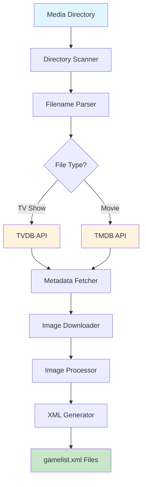
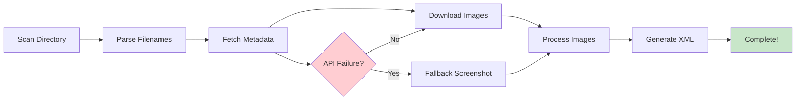

# MPV Metadata Scraper

A command-line tool to automatically scrape metadata for TV shows and movies and generate EmulationStation-compatible `gamelist.xml` files for the Knulli UI.

## 🏗️ System Architecture



## 🔄 Workflow Overview



## Documentation

📚 **Comprehensive documentation is available in the [`docs/`](docs/) directory:**

- **[📖 Documentation Index](docs/README.md)** - Complete guide to all documentation
- **[🚀 Quick Start](docs/user/QUICK_START.md)** - Get up and running in minutes
- **[🔧 API Troubleshooting](docs/technical/API_TROUBLESHOOTING.md)** - Fix authentication issues
- **[⚡ Performance Guide](docs/technical/PERFORMANCE.md)** - Optimize for large libraries
- **[🛠️ Development Guide](docs/technical/DEVELOPMENT.md)** - Contributing to the project

## Installation

1.  **Clone the repository:**
    ```bash
    git clone <repository_url>
    cd mpv-scraper
    ```

2.  **Create a virtual environment:**
    ```bash
    python3 -m venv .venv
    source .venv/bin/activate
    ```

3.  **Install dependencies:**
    ```bash
    pip install -r requirements.txt
    ```

4.  **Set up API keys:**
    Export your API keys as environment variables.
    ```bash
    export TVDB_API_KEY="YOUR_TVDB_API_KEY"
    export TMDB_API_KEY="YOUR_TMDB_API_KEY"
    ```

5.  **Install pre-commit hooks (recommended):**
    ```bash
    pip install pre-commit
    pre-commit install
    ```

## Development Workflow

### Pre-commit Hooks

This project uses pre-commit hooks to ensure code quality and test coverage:

- **Code Formatting:** Black and Ruff automatically format and lint your code
- **Tests:** Pytest runs automatically before each commit
- **Smart Test Selection:** The pre-commit hook intelligently runs only relevant tests based on changed files

### Pre-push Hooks

A Git pre-push hook ensures all tests pass before pushing to remote:

- **Full Test Suite:** Runs the complete test suite before allowing push
- **Automatic Blocking:** Push is blocked if any tests fail
- **Helpful Error Messages:** Provides clear guidance on fixing test failures

### Running Tests Manually

```bash
# Run all tests
python -m pytest

# Run specific test categories
python -m pytest tests/e2e/          # End-to-end tests
python -m pytest tests/integration/  # Integration tests
python -m pytest tests/smoke/        # Smoke tests

# Run with verbose output
python -m pytest -v

# Run with coverage
python -m pytest --cov=mpv_scraper
```

## Usage

The tool will provide several commands to manage the scraping process. The primary command will be `run`, which executes the entire workflow.

```bash
# Run the full scraping and generation process on the /mpv directory
python -m mpv_scraper.cli run /path/to/your/mpv/folder
```

## Error Handling & Resilience

The scraper is designed to be resilient to common failures:

- **Network Retries:** Download functions automatically retry up to 3 times with exponential backoff (1s, 2s, 4s delays)
- **Missing Artwork:** If poster or logo downloads fail, placeholder PNG images are created automatically
- **Partial Failures:** The scraper continues processing even if some operations fail, ensuring metadata is still captured
- **Graceful Degradation:** Missing artwork doesn't prevent metadata scraping or XML generation

This ensures the scraper completes successfully even in challenging network conditions or when some artwork is unavailable.
<!-- ci trigger -->
