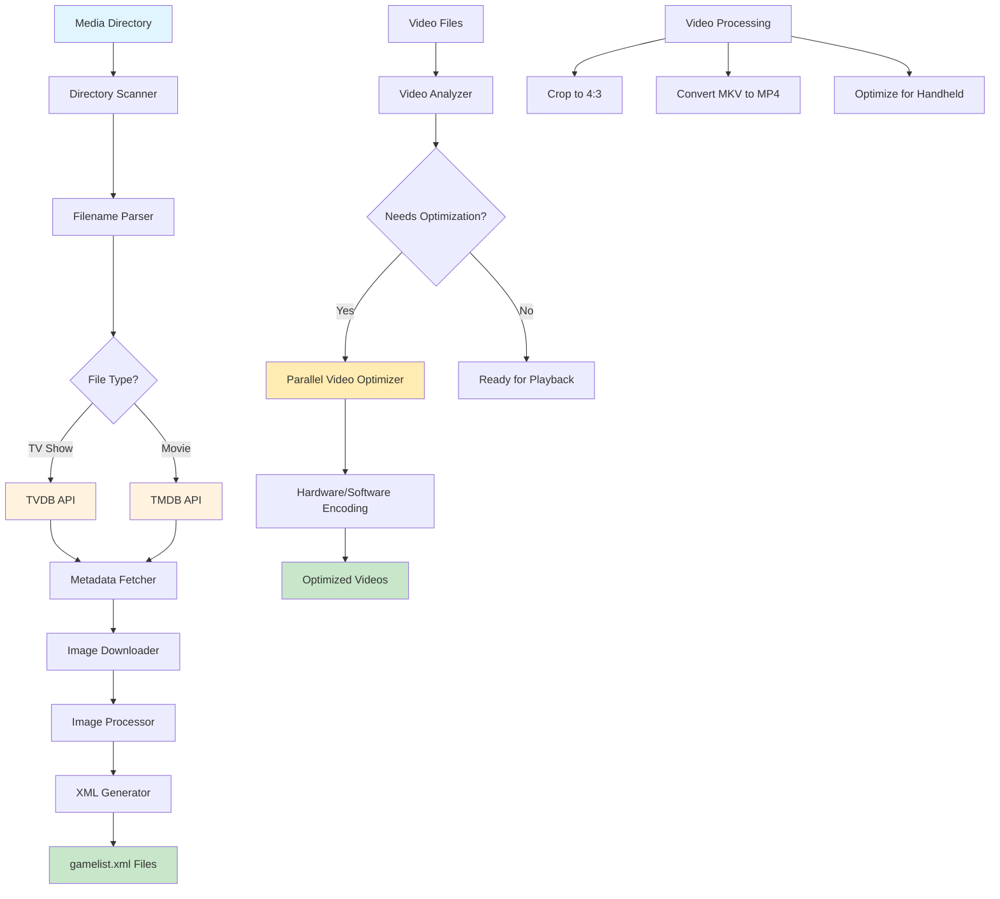
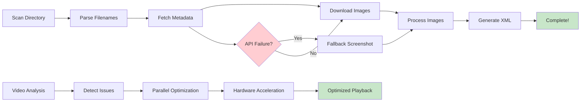

# MPV Metadata Scraper

A command-line tool to automatically scrape metadata for TV shows and movies, generate EmulationStation-compatible `gamelist.xml` files for the Knulli UI, and optimize video files for handheld device playback.

## 🏗️ System Architecture



## 🔄 Workflow Overview



## 🚀 New Features

### **Video Optimization & Processing**
- **🎯 Smart Video Analysis**: Automatically detects problematic video files (AI-upscaled, high bitrate, complex codecs)
- **⚡ Parallel Processing**: Multi-core optimization with hardware acceleration (6x faster than sequential)
- **🖥️ Hardware Acceleration**: Uses `h264_videotoolbox` on macOS for blazing-fast encoding
- **📱 Handheld Optimization**: Converts videos to handheld-friendly formats (H.264, 720p, optimized bitrate)
- **💾 Space Management**: Optional `--replace-originals` flag to save disk space

### **Video Format Conversion**
- **🔄 MKV to MP4**: Convert MKV files to web-optimized MP4 format
- **🎬 Two Conversion Presets**:
  - `convert-with-subs`: Web optimized with soft subtitles
  - `convert-without-subs`: Web optimized without subtitles
- **📊 Size Reduction**: ~2/3 file size reduction while maintaining quality

### **Video Cropping**
- **✂️ 4:3 Cropping**: Automatically crop 16:9 videos with letterboxing to 4:3 aspect ratio
- **🎯 Smart Detection**: Uses FFprobe to detect letterboxing and calculate optimal crop area
- **⚙️ Quality Options**: Fast, medium, and high-quality encoding presets

## 📚 Documentation

📚 **Comprehensive documentation is available in the [`docs/`](docs/) directory:**

- **[📖 Documentation Index](docs/README.md)** - Complete guide to all documentation
- **[🚀 Quick Start](docs/user/QUICK_START.md)** - Get up and running in minutes
- **[🖥️ User Interface](docs/USER_INTERFACE.md)** - TUI usage and logs
- **[🎬 Video Processing Guide](docs/user/VIDEO_PROCESSING.md)** - Video optimization and conversion
- **[🔧 API Troubleshooting](docs/technical/API_TROUBLESHOOTING.md)** - Fix authentication issues
- **[⚡ Performance Guide](docs/technical/PERFORMANCE.md)** - Optimize for large libraries
- **[🛠️ Development Guide](docs/technical/DEVELOPMENT.md)** - Contributing to the project

## Installation

1.  **Clone the repository:**
    ```bash
    git clone <repository_url>
    cd mpv-scraper
    ```

2.  **Create a virtual environment:**
    ```bash
    python3 -m venv .venv
    source .venv/bin/activate
    ```

3.  **Install dependencies:**
    ```bash
    pip install -r requirements.txt
    ```

4.  **Install FFmpeg (required for video processing):**
    ```bash
    # macOS
    brew install ffmpeg

    # Ubuntu/Debian
    sudo apt update && sudo apt install ffmpeg

    # Windows
    # Download from https://ffmpeg.org/download.html
    ```

5.  **Set up API keys:**
    Export your API keys as environment variables.
    ```bash
    export TVDB_API_KEY="YOUR_TVDB_API_KEY"
    export TMDB_API_KEY="YOUR_TMDB_API_KEY"
    ```

6.  **Install pre-commit hooks (recommended):**
    ```bash
    pip install pre-commit
    pre-commit install
    ```

## Usage

### **First-run setup**

Initialize a library with prerequisites check and config scaffolding:

```bash
python -m mpv_scraper.cli init /path/to/your/mpv/folder
```

This writes `mpv-scraper.toml`, `.env(.example)`, and creates `images/` and `Movies/`.

### **Core Scraping Commands**

```bash
# Run the full scraping and generation process
python -m mpv_scraper.cli run /path/to/your/mpv/folder

# Scan directory structure
python -m mpv_scraper.cli scan /path/to/your/mpv/folder

# Scrape metadata only
python -m mpv_scraper.cli scrape /path/to/your/mpv/folder

# Generate XML files only
python -m mpv_scraper.cli generate /path/to/your/mpv/folder

# Undo previous operations
python -m mpv_scraper.cli undo
```

### **Video Processing Commands**

```bash
# Analyze videos for handheld compatibility
python -m mpv_scraper.cli analyze /path/to/videos

# Optimize videos for handheld devices (sequential)
python -m mpv_scraper.cli optimize /path/to/videos --preset handheld

# Optimize videos with parallel processing (6x faster!)
python -m mpv_scraper.cli optimize-parallel /path/to/videos --preset handheld

# Optimize and replace originals (save disk space) with auto-confirm and progress bar
python -m mpv_scraper.cli optimize-parallel /path/to/videos --preset handheld --replace-originals -y

# Optimize, replace originals, and regenerate gamelist.xml when finished
python -m mpv_scraper.cli optimize-parallel /path/to/videos --preset handheld --replace-originals -y --regen-gamelist

# Crop videos to 4:3 aspect ratio
python -m mpv_scraper.cli crop /path/to/videos --quality medium

# Convert MKV to MP4 with subtitles
python -m mpv_scraper.cli convert-with-subs /path/to/videos

# Convert MKV to MP4 without subtitles
python -m mpv_scraper.cli convert-without-subs /path/to/videos
```

### **Advanced Video Optimization**

```bash
# Parallel optimization with custom worker count
python -m mpv_scraper.cli optimize-parallel /path/to/videos --workers 8

# Compatibility mode (maximum compatibility, smaller files)
python -m mpv_scraper.cli optimize-parallel /path/to/videos --preset compatibility

# Dry run to see what would be processed
python -m mpv_scraper.cli optimize-parallel /path/to/videos --dry-run
```

## 🎯 Video Optimization Features

### **Smart Problem Detection**
The optimizer automatically identifies problematic videos:
- **HEVC/H.265 codecs** (CPU intensive on handheld devices)
- **10-bit color depth** (requires more processing power)
- **High bitrates** (>5 Mbps)
- **AI-upscaled content** (complex encoding)
- **Large file sizes** (>1GB per episode)

### **Optimization Results**
- **File Size**: 1GB → ~200MB (80% reduction)
- **Codec**: HEVC → H.264 (better compatibility)
- **Resolution**: 1440x1080 → 960x720 (handheld-friendly)
- **Bitrate**: 6 Mbps → 1.5 Mbps (smooth playback)
- **Processing Speed**: 6x faster with parallel processing

### **Hardware Acceleration**
- **macOS**: Uses `h264_videotoolbox` for hardware encoding
- **Fallback**: Automatic fallback to software encoding if hardware fails
- **Multi-threading**: Uses all available CPU cores for maximum performance

## Development Workflow

### Pre-commit Hooks

This project uses pre-commit hooks to ensure code quality and test coverage:

- **Code Formatting:** Black and Ruff automatically format and lint your code
- **Tests:** Pytest runs automatically before each commit
- **Smart Test Selection:** The pre-commit hook intelligently runs only relevant tests based on changed files

### Pre-push Hooks

A Git pre-push hook ensures all tests pass before pushing to remote:

- **Full Test Suite:** Runs the complete test suite before allowing push
- **Automatic Blocking:** Push is blocked if any tests fail
- **Helpful Error Messages:** Provides clear guidance on fixing test failures

### Running Tests Manually

```bash
# Run all tests
python -m pytest

# Run specific test categories
python -m pytest tests/e2e/          # End-to-end tests
python -m pytest tests/integration/  # Integration tests
python -m pytest tests/smoke/        # Smoke tests
python -m pytest tests/video/        # Video processing tests

# Run with verbose output
python -m pytest -v

# Run with coverage
python -m pytest --cov=mpv_scraper
```

## Error Handling & Resilience

The scraper is designed to be resilient to common failures:

- **Network Retries:** Download functions automatically retry up to 3 times with exponential backoff (1s, 2s, 4s delays)
- **Missing Artwork:** If poster or logo downloads fail, placeholder PNG images are created automatically
- **Partial Failures:** The scraper continues processing even if some operations fail, ensuring metadata is still captured
- **Graceful Degradation:** Missing artwork doesn't prevent metadata scraping or XML generation
- **Video Processing:** Hardware acceleration with automatic fallback to software encoding
- **Disk Space Management:** Smart detection and warnings for low disk space conditions

This ensures the scraper completes successfully even in challenging network conditions or when some artwork is unavailable.

## 🎬 Video Processing Examples

### **Optimizing AI-Upscaled Content**
```bash
# Analyze problematic files
python -m mpv_scraper.cli analyze "/Volumes/SD/roms/mpv/Teenage Mutant Ninja Turtles (1987)"

# Parallel optimization with space savings
python -m mpv_scraper.cli optimize-parallel "/Volumes/SD/roms/mpv/Teenage Mutant Ninja Turtles (1987)" --replace-originals
```

### **Converting MKV Collections**
```bash
# Convert with subtitles (web optimized)
python -m mpv_scraper.cli convert-with-subs "/path/to/mkv/files"

# Convert without subtitles (smaller files)
python -m mpv_scraper.cli convert-without-subs "/path/to/mkv/files"
```

### **Cropping for 4:3 Displays**
```bash
# Crop 16:9 videos with letterboxing to 4:3
python -m mpv_scraper.cli crop "/path/to/videos" --quality high
```

## 📊 Performance Benchmarks

### **Parallel vs Sequential Processing**
- **Sequential**: ~10.5 hours for 192 episodes
- **Parallel (6 workers)**: ~1.7 hours for 192 episodes
- **Speedup**: **6.2x faster**

### **File Size Optimization**
- **Original**: 1GB per episode (HEVC, 10-bit, 6 Mbps)
- **Optimized**: 200MB per episode (H.264, 8-bit, 1.5 Mbps)
- **Space Savings**: 80% reduction

### **Hardware Acceleration**
- **Software Encoding**: ~3-5 minutes per episode
- **Hardware Encoding**: ~1-2 minutes per episode
- **Speedup**: **2-3x faster**
