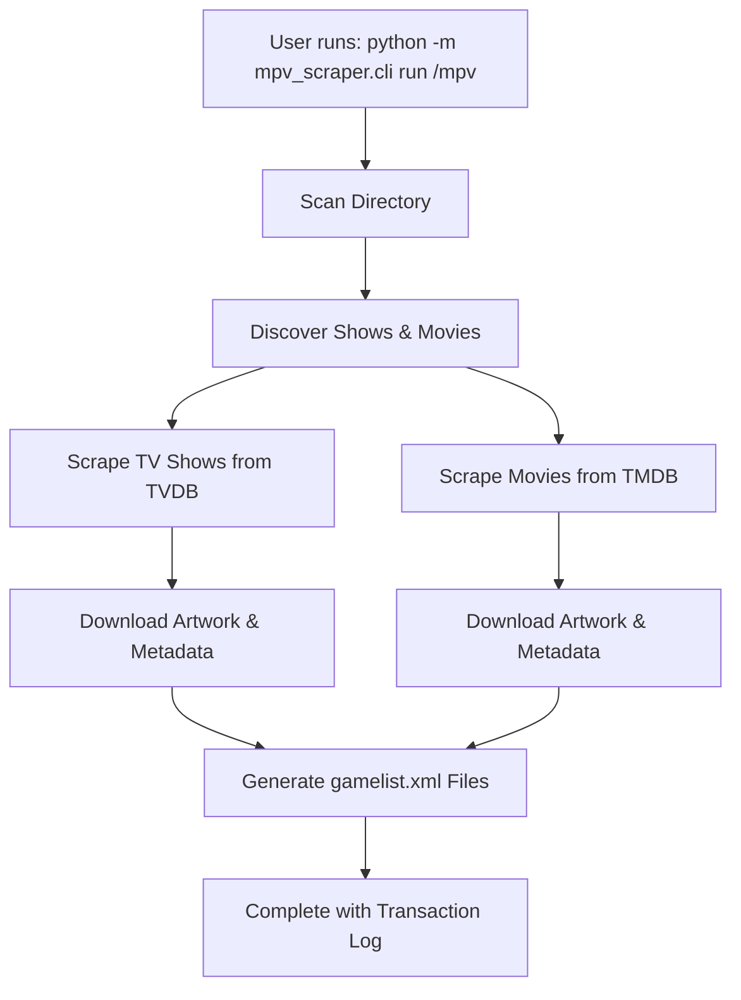

# MPV Scraper Flow Assessment & Documentation Review

## Executive Summary

This document provides a comprehensive assessment of the MPV Metadata Scraper's current state, documentation coverage, and workflow completeness. The assessment was conducted on the `docs-flow-assessment` branch following the completion of Sprint 10 (Live Scraping Integration).

## Current State Assessment

### ✅ **Completed Features**

#### Core Functionality
- **Directory Scanning**: Robust discovery of TV shows and movies
- **Filename Parsing**: Support for TV episodes (including anthology spans) and movies
- **API Integration**: Full TVDB (v3) and TMDB integration with authentication
- **Metadata Scraping**: Complete scraping of descriptions, ratings, and artwork
- **XML Generation**: EmulationStation-compatible `gamelist.xml` files
- **Error Handling**: Comprehensive retry logic and graceful fallbacks
- **Transaction Logging**: Full undo capability with `transaction.log`

#### CLI Commands
- `scan` - Directory discovery and summary
- `scrape` - Metadata and artwork download
- `generate` - XML file generation
- `run` - Complete workflow (scan → scrape → generate)
- `undo` - Rollback functionality
- `sync-logos` - Manual logo synchronization

#### Testing Coverage
- **74 tests passing** across all categories
- Unit tests for all core functions
- Integration tests for API interactions
- End-to-end tests for complete workflows
- Smoke tests for CLI commands
- Regression tests for edge cases

### 📊 **Documentation Coverage Analysis**

#### ✅ **Well Documented**
1. **README.md** - Comprehensive project overview with examples
2. **docs/QUICK_START.md** - Step-by-step setup and usage guide
3. **docs/error_handling.md** - Detailed retry logic and resilience features
4. **docs/TESTING.md** - Complete testing instructions
5. **docs/DEVELOPMENT.md** - Development workflow and guidelines

#### ⚠️ **Partially Documented**
1. **API Key Setup** - Basic instructions exist but could be more detailed
2. **sync-logos Command** - Help text exists but no dedicated documentation
3. **Advanced Usage** - Limited examples for complex scenarios

#### ❌ **Missing Documentation**
1. **API Troubleshooting Guide** - Common API issues and solutions
2. **Performance Optimization** - Tips for large libraries
3. **Customization Guide** - How to modify behavior for specific needs
4. **Migration Guide** - Upgrading from previous versions

## Workflow Analysis

### **Primary Workflow: `run` Command**

### **Individual Command Workflows**

#### `scan` Command
- **Purpose**: Debug helper for directory discovery
- **Output**: Summary of shows and movies found
- **Use Case**: Verify directory structure before scraping

#### `scrape` Command
- **Purpose**: Download metadata and artwork
- **Features**:
  - Automatic retry with exponential backoff
  - Placeholder images for failed downloads
  - Cache creation for later generation
- **Output**: Images and `.scrape_cache.json` files

#### `generate` Command
- **Purpose**: Create XML files from scraped data
- **Features**:
  - Reads from scrape cache
  - Generates EmulationStation-compatible XML
  - Includes extended metadata (descriptions, ratings, marquees)

#### `undo` Command
- **Purpose**: Rollback changes using transaction log
- **Features**: Restores previous state completely

#### `sync-logos` Command
- **Purpose**: Manual logo synchronization
- **Features**: Updates XML to use manually downloaded logos
- **Naming Convention**: `{show}-logo.png`, `{show}-box.png`, `{show}-marquee.png`

## Documentation Gaps & Recommendations

### **High Priority**

#### 1. **API Key Troubleshooting Guide**
**Current State**: Basic setup instructions exist
**Gap**: No troubleshooting for common API issues
**Recommendation**: Create `docs/API_TROUBLESHOOTING.md`

**Content Needed**:
- Common authentication errors and solutions
- Rate limiting handling
- Legacy vs. new API key formats
- Environment variable troubleshooting
- Network connectivity issues

#### 2. **sync-logos Command Documentation**
**Current State**: Only help text available
**Gap**: No dedicated documentation
**Recommendation**: Add section to QUICK_START.md or create dedicated guide

**Content Needed**:
- Use cases for manual logo management
- Naming convention examples
- Integration with existing workflow
- Troubleshooting common issues

### **Medium Priority**

#### 3. **Performance Optimization Guide**
**Current State**: No performance documentation
**Gap**: No guidance for large libraries
**Recommendation**: Create `docs/PERFORMANCE.md`

**Content Needed**:
- Large library optimization tips
- Caching strategies
- Network optimization
- Memory usage considerations
- Parallel processing options

#### 4. **Advanced Usage Examples**
**Current State**: Basic examples only
**Gap**: Limited complex scenario coverage
**Recommendation**: Expand QUICK_START.md or create `docs/ADVANCED_USAGE.md`

**Content Needed**:
- Complex directory structures
- Custom naming conventions
- Batch processing
- Integration with other tools
- Automation examples

### **Low Priority**

#### 5. **Customization Guide**
**Current State**: No customization documentation
**Gap**: No guidance for modifying behavior
**Recommendation**: Create `docs/CUSTOMIZATION.md`

**Content Needed**:
- Configuration file options
- Custom parsers
- Modified workflows
- Plugin architecture (future)

#### 6. **Migration Guide**
**Current State**: No migration documentation
**Gap**: No upgrade path documentation
**Recommendation**: Create `docs/MIGRATION.md` when needed

## Code Quality Assessment

### **Strengths**
- **Comprehensive Testing**: 74 tests with good coverage
- **Error Handling**: Robust retry logic and fallbacks
- **Type Hints**: Good type annotation coverage
- **Documentation**: Well-documented functions and modules
- **Modular Design**: Clean separation of concerns

### **Areas for Improvement**
- **API Key Management**: Could benefit from more robust key validation
- **Logging**: Could use structured logging for better debugging
- **Configuration**: Could support configuration files for advanced users
- **Performance**: Could add progress bars for large operations

## Recommendations

### **Immediate Actions (This Branch)**
1. **Create API Troubleshooting Guide** - Address common user issues
2. **Document sync-logos Command** - Complete command documentation
3. **Update QUICK_START.md** - Add more examples and edge cases
4. **Add Performance Tips** - Include in existing documentation

### **Future Enhancements**
1. **Configuration System** - Support for `.mpv-scraper.conf` files
2. **Progress Indicators** - Better user feedback for large operations
3. **Structured Logging** - Enhanced debugging capabilities
4. **Plugin Architecture** - Support for custom parsers and providers

## Conclusion

The MPV Metadata Scraper is in excellent condition with comprehensive functionality and good documentation coverage. The core workflow is complete and well-tested. The main gaps are in troubleshooting guides and advanced usage documentation, which can be addressed in this documentation assessment branch.

**Overall Assessment**: ✅ **Production Ready** with minor documentation improvements needed.
