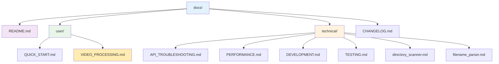

# MPV Scraper Documentation

Welcome to the MPV Scraper documentation! This guide helps you find the right information for your needs.

## 📚 Documentation Structure

### 🎯 **For End Users**
- **[Quick Start Guide](user/QUICK_START.md)** - Get up and running in minutes
- **[Video Processing Guide](user/VIDEO_PROCESSING.md)** - Video optimization, conversion, and cropping

### 🔧 **For Developers & Advanced Users**
- **[API Troubleshooting](technical/API_TROUBLESHOOTING.md)** - Fix TVDB/TMDB authentication issues
- **[Performance Optimization](technical/PERFORMANCE.md)** - Optimize for large libraries
- **[Development Guide](technical/DEVELOPMENT.md)** - Contributing to the project
- **[Testing Guide](technical/TESTING.md)** - Running tests and quality assurance

### 🔍 **Technical Reference**
- **[Directory Scanner](technical/directory_scanner.md)** - How file discovery works
- **[Filename Parser](technical/filename_parser.md)** - Understanding filename parsing logic

## 🚀 **Quick Navigation**

### **Getting Started**
1. **New User?** → [Quick Start Guide](user/QUICK_START.md)
2. **Video Processing?** → [Video Processing Guide](user/VIDEO_PROCESSING.md)
3. **API Issues?** → [API Troubleshooting](technical/API_TROUBLESHOOTING.md)
4. **Performance Problems?** → [Performance Guide](technical/PERFORMANCE.md)

### **Development**
1. **Contributing?** → [Development Guide](technical/DEVELOPMENT.md)
2. **Running Tests?** → [Testing Guide](technical/TESTING.md)
3. **Understanding Code?** → [Technical Reference](#technical-reference)

## 📖 **Documentation Summary**

| Document | Purpose | Audience |
|----------|---------|----------|
| [Quick Start](user/QUICK_START.md) | Basic setup and usage | End users |
| [Video Processing](user/VIDEO_PROCESSING.md) | Video optimization & conversion | End users |
| [API Troubleshooting](technical/API_TROUBLESHOOTING.md) | Fix authentication issues | Advanced users |
| [Performance](technical/PERFORMANCE.md) | Optimize large libraries | Advanced users |
| [Development](technical/DEVELOPMENT.md) | Contributing guidelines | Developers |
| [Testing](technical/TESTING.md) | Quality assurance | Developers |
| [Directory Scanner](technical/directory_scanner.md) | File discovery logic | Developers |
| [Filename Parser](technical/filename_parser.md) | Parsing algorithms | Developers |

## 🎯 **Common Use Cases**

### **First Time Setup**
1. Read [Quick Start Guide](user/QUICK_START.md)
2. Set up API keys (see [API Troubleshooting](technical/API_TROUBLESHOOTING.md))
3. Run your first scrape

### **Video Processing**
1. **Optimize videos** → [Video Processing Guide](user/VIDEO_PROCESSING.md#video-optimization)
2. **Convert MKV to MP4** → [Video Processing Guide](user/VIDEO_PROCESSING.md#video-format-conversion)
3. **Crop to 4:3** → [Video Processing Guide](user/VIDEO_PROCESSING.md#video-cropping)

### **Troubleshooting**
1. Check [API Troubleshooting](technical/API_TROUBLESHOOTING.md) for authentication issues
2. Review [Video Processing Guide](user/VIDEO_PROCESSING.md#troubleshooting) for video issues
3. Consult [Performance Guide](technical/PERFORMANCE.md) for optimization

### **Development**
1. Read [Development Guide](technical/DEVELOPMENT.md) for contribution guidelines
2. Use [Testing Guide](technical/TESTING.md) for quality assurance
3. Reference technical docs for implementation details

## 🎬 **Video Processing Features**

### **Smart Video Optimization**
- **Problem Detection**: Automatically identifies problematic videos (HEVC, 10-bit, high bitrate)
- **Parallel Processing**: 6x faster with multi-core optimization
- **Hardware Acceleration**: Uses hardware encoders when available
- **Space Management**: Optional replacement of original files

### **Format Conversion**
- **MKV to MP4**: Web-optimized conversion with subtitle support
- **Size Reduction**: ~2/3 file size reduction
- **Quality Preservation**: Maintains visual quality while optimizing

### **Aspect Ratio Cropping**
- **4:3 Cropping**: Automatically crop 16:9 videos with letterboxing
- **Smart Detection**: Uses FFprobe to detect black bars
- **Quality Options**: Fast, medium, and high-quality presets

## 📝 **Documentation Standards**

- **User docs**: Focus on practical usage and troubleshooting
- **Technical docs**: Include implementation details and code examples
- **All docs**: Use clear headings, code blocks, and examples
- **Cross-references**: Link between related documents

## 🤝 **Contributing to Documentation**

When updating documentation:
1. Place user-focused content in `/docs/user/`
2. Place technical content in `/docs/technical/`
3. Update this index when adding new documents
4. Use clear, concise language
5. Include practical examples

---

**Need help?** Start with the [Quick Start Guide](user/QUICK_START.md) or check the [Video Processing Guide](user/VIDEO_PROCESSING.md) for video-related features.
