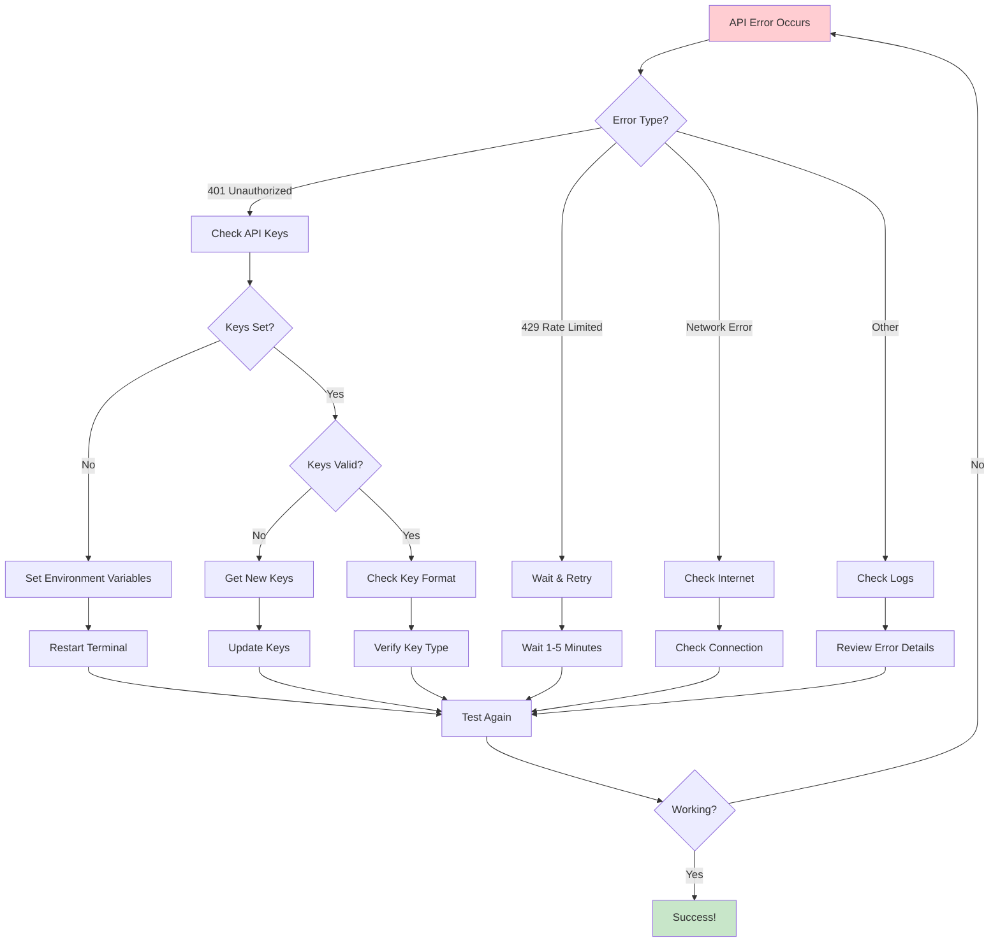

# API Troubleshooting Guide

Fix common TVDB and TMDB authentication and connectivity issues.

## 🔍 Troubleshooting Flow



## Common Issues

### Common Error: 401 Unauthorized

**Symptoms:**
- `401 Client Error: Unauthorized for url: https://api.thetvdb.com/login`
- `401 Client Error: Unauthorized for url: https://api.thetvdb.com/search/series`

**Causes & Solutions:**

#### 1. **Incorrect API Key Format**
**Problem**: Using a PIN instead of an API key
**Solution**:
- Go to [TheTVDB Dashboard](https://thetvdb.com/dashboard/api)
- Generate a new API key (not a PIN)
- API keys are typically 32+ characters long
- PINs are shorter (8 characters) and won't work

#### 2. **Environment Variable Not Set**
**Problem**: `TVDB_API_KEY` environment variable is not loaded
**Solution**:
```bash
# Check if variable is set
echo $TVDB_API_KEY

# Set the variable
export TVDB_API_KEY="your_actual_api_key_here"

# Verify it's set correctly
python -c "import os; print('TVDB_API_KEY:', os.getenv('TVDB_API_KEY'))"
```

#### 3. **Legacy vs. New API Key**
**Problem**: Using a v4 API key with v3 endpoints
**Solution**:
- The scraper uses TVDB v3 API
- Ensure you're using a v3 API key from the dashboard
- v4 keys (JWT tokens) are not supported

#### 4. **API Key Expired or Revoked**
**Problem**: Previously working key now fails
**Solution**:
- Log into [TheTVDB Dashboard](https://thetvdb.com/dashboard/api)
- Generate a new API key
- Update your environment variable

### Rate Limiting Issues

**Symptoms:**
- `429 Too Many Requests`
- Intermittent failures

**Solutions:**
- The scraper includes built-in rate limiting
- Wait a few minutes between large scraping operations
- Consider breaking large libraries into smaller batches

## TMDB API Issues

### Common Error: 401 Unauthorized

**Symptoms:**
- `401 Client Error: Unauthorized for url: https://api.themoviedb.org/3/search/movie`

**Causes & Solutions:**

#### 1. **API Key vs. Bearer Token Confusion**
**Problem**: Using wrong authentication method
**Solution**:
- **API Key**: Use as query parameter (recommended)
- **Bearer Token**: Use in Authorization header
- The scraper supports both formats automatically

#### 2. **Environment Variable Issues**
**Problem**: `TMDB_API_KEY` not set correctly
**Solution**:
```bash
# Check current value
echo $TMDB_API_KEY

# Set API key (recommended)
export TMDB_API_KEY="your_api_key_here"

# Or set Bearer token
export TMDB_API_KEY="eyJhbGciOiJIUzI1NiJ9..."

# Verify
python -c "import os; print('TMDB_API_KEY:', os.getenv('TMDB_API_KEY')[:20] + '...')"
```

#### 3. **Invalid API Key**
**Problem**: Key is malformed or expired
**Solution**:
- Go to [TMDB Settings](https://www.themoviedb.org/settings/api)
- Generate a new API key
- Ensure you have "Read" access enabled

### Rate Limiting Issues

**Symptoms:**
- `429 Too Many Requests`
- Intermittent search failures

**Solutions:**
- TMDB allows 40 requests per 10 seconds
- The scraper includes retry logic with backoff
- For large libraries, consider running during off-peak hours

## Environment Variable Troubleshooting

### Common Issues

#### 1. **Variables Not Persisting**
**Problem**: Variables lost after terminal restart
**Solution**:
```bash
# Add to your shell profile
echo 'export TVDB_API_KEY="your_key"' >> ~/.zshrc
echo 'export TMDB_API_KEY="your_key"' >> ~/.zshrc

# Reload profile
source ~/.zshrc
```

#### 2. **Wrong Shell Profile**
**Problem**: Variables set in wrong profile file
**Solution**:
```bash
# Check which shell you're using
echo $SHELL

# For zsh (most common on macOS)
echo 'export TVDB_API_KEY="your_key"' >> ~/.zshrc

# For bash
echo 'export TVDB_API_KEY="your_key"' >> ~/.bashrc

# For fish
echo 'set -gx TVDB_API_KEY "your_key"' >> ~/.config/fish/config.fish
```

#### 3. **Virtual Environment Issues**
**Problem**: Variables not available in virtual environment
**Solution**:
```bash
# Activate virtual environment first
source .venv/bin/activate

# Then set variables
export TVDB_API_KEY="your_key"
export TMDB_API_KEY="your_key"

# Or set them in the virtual environment activation script
echo 'export TVDB_API_KEY="your_key"' >> .venv/bin/activate
```

### Using .env Files

**Alternative**: Use a `.env` file for easier management

```bash
# Create .env file
cat > .env << EOF
TVDB_API_KEY=your_tvdb_key_here
TMDB_API_KEY=your_tmdb_key_here
EOF

# The scraper automatically loads .env files
python -m mpv_scraper.cli run /mpv
```

## Network Connectivity Issues

### Common Problems

#### 1. **Firewall Blocking**
**Symptoms**: Connection timeout errors
**Solution**:
- Ensure outbound HTTPS (port 443) is allowed
- Check corporate firewall settings
- Try from a different network

#### 2. **DNS Resolution Issues**
**Symptoms**: `NameResolutionError` or similar
**Solution**:
```bash
# Test DNS resolution
nslookup api.thetvdb.com
nslookup api.themoviedb.org

# Try using different DNS servers
# (8.8.8.8 for Google DNS, 1.1.1.1 for Cloudflare)
```

#### 3. **Proxy Issues**
**Symptoms**: Connection failures in corporate environments
**Solution**:
```bash
# Set proxy if needed
export HTTP_PROXY="http://proxy.company.com:8080"
export HTTPS_PROXY="http://proxy.company.com:8080"

# Or configure in Python
export REQUESTS_CA_BUNDLE="/path/to/cert.pem"
```

## Testing Your Setup

### Step-by-Step Verification

1. **Test Environment Variables**:
```bash
python -c "
import os
from dotenv import load_dotenv
load_dotenv()
print('TVDB_API_KEY:', 'SET' if os.getenv('TVDB_API_KEY') else 'NOT SET')
print('TMDB_API_KEY:', 'SET' if os.getenv('TMDB_API_KEY') else 'NOT SET')
"
```

2. **Test TVDB Authentication**:
```bash
python -c "
from mpv_scraper.tvdb import authenticate_tvdb
try:
    token = authenticate_tvdb()
    print('✅ TVDB: Authentication successful')
except Exception as e:
    print(f'❌ TVDB: {e}')
"
```

3. **Test TMDB Authentication**:
```bash
python -c "
from mpv_scraper.tmdb import search_movie
try:
    results = search_movie('Moana', 2016)
    print(f'✅ TMDB: Found {len(results)} results')
except Exception as e:
    print(f'❌ TMDB: {e}')
"
```

4. **Run Full Test Suite**:
```bash
python -m pytest tests/test_api_keys.py -v -s
```

## Getting Help

### Debug Information

When reporting issues, include:

1. **Error Messages**: Full error output
2. **Environment**: OS, Python version, virtual environment status
3. **API Keys**: Format (not the actual keys) - API key vs. Bearer token
4. **Network**: Corporate network, VPN, firewall status
5. **Test Results**: Output from the testing commands above

### Common Debug Commands

```bash
# Check Python environment
python --version
which python

# Check virtual environment
echo $VIRTUAL_ENV

# Check environment variables
env | grep -E "(TVDB|TMDB)"

# Test network connectivity
curl -I https://api.thetvdb.com
curl -I https://api.themoviedb.org
```

## Prevention Tips

1. **Use .env Files**: Easier to manage than environment variables
2. **Test Regularly**: Run API tests before large scraping operations
3. **Monitor Rate Limits**: Be aware of API usage limits
4. **Keep Keys Secure**: Don't commit API keys to version control
5. **Backup Keys**: Store API keys securely for easy recovery

---

**Still having issues?** Check the [main troubleshooting section](QUICK_START.md#troubleshooting) in the Quick Start Guide for additional help.
