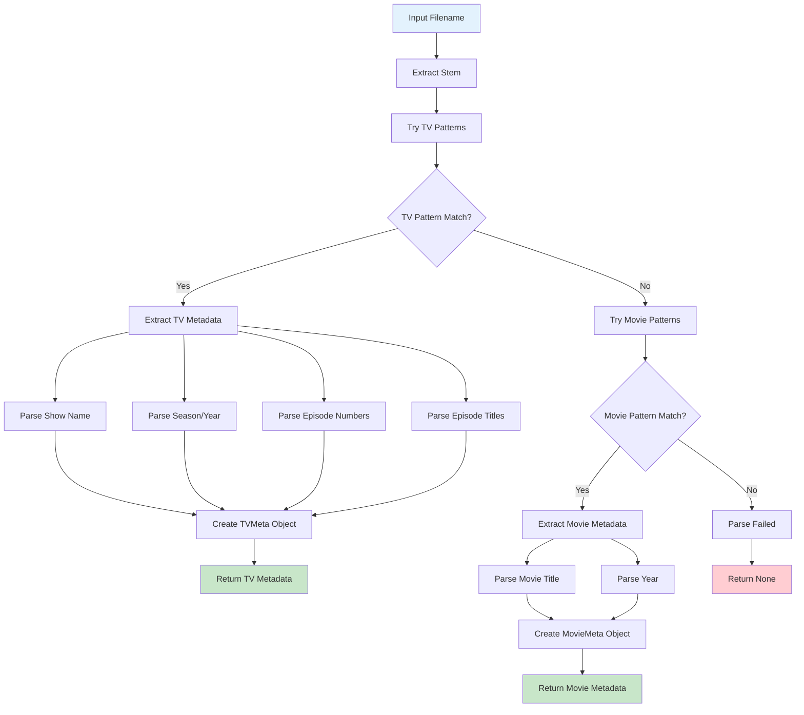

# Filename Parser

Understanding how the MPV Scraper parses different filename formats for TV shows and movies.

## 📝 Filename Parsing Flow

```mermaid
flowchart TD
    A[Input Filename] --> B[Extract Stem]
    B --> C[Try TV Patterns]

    C --> D{TV Pattern Match?}
    D -->|Yes| E[Extract TV Metadata]
    D -->|No| F[Try Movie Patterns]

    E --> G[Parse Show Name]
    E --> H[Parse Season/Year]
    E --> I[Parse Episode Numbers]
    E --> J[Parse Episode Titles]

    F --> K{Movie Pattern Match?}
    K -->|Yes| L[Extract Movie Metadata]
    K -->|No| M[Parse Failed]

    L --> N[Parse Movie Title]
    L --> O[Parse Year]

    G --> P[Create TVMeta Object]
    H --> P
    I --> P
    J --> P

    N --> Q[Create MovieMeta Object]
    O --> Q

    P --> R[Return TV Metadata]
    Q --> S[Return Movie Metadata]
    M --> T[Return None]

    style A fill:#e3f2fd
    style R fill:#c8e6c9
    style S fill:#c8e6c9
    style T fill:#ffcdd2
```

## Supported Formats
