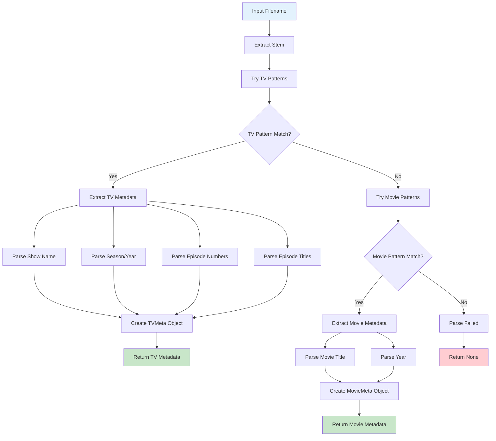

# Filename Parser

Understanding how the MPV Scraper parses different filename formats for TV shows and movies.

## 📝 Filename Parsing Flow



## API Tag Support

The parser supports API tags embedded in filenames for direct metadata lookup. API tags are extracted before other parsing logic and removed from the filename stem.

### Format
- **Pattern**: `{provider-id}` at the end of filename (before extension)
- **Case-insensitive**: `{TVDB-70533}` works the same as `{tvdb-70533}`
- **Multiple tags**: If multiple tags are present, the last one is used
- **Supported providers**: `tvdb`, `tmdb`, `omdb`, `tvmaze`, `anidb`, `fanarttv`

### Examples
```text
# TV show with TVDB tag
Twin Peaks - S01E01 - Pilot {tvdb-70533}.mp4

# Movie with TMDB tag
Clue (1985) {tmdb-15196}.mkv

# Movie with OMDb tag (IMDb ID)
The Terminator (1984) {omdb-tt0088247}.mp4

# Case-insensitive
Show Name - S01E01 {TVDB-12345}.mkv
```

### Parsing Flow
1. Extract API tag from filename using regex pattern `\{([a-zA-Z]+)-(\d+)\}`
2. Normalize provider name to lowercase
3. Validate provider is in supported list
4. Remove tag from filename stem before title parsing
5. Store tag in `TVMeta.api_tag` or `MovieMeta.api_tag` field

### Benefits
- **Direct lookup**: Bypasses search, uses exact API ID
- **Faster**: No search API calls needed
- **More accurate**: Eliminates ambiguity
- **Fewer API calls**: More efficient than search

## Supported Formats
