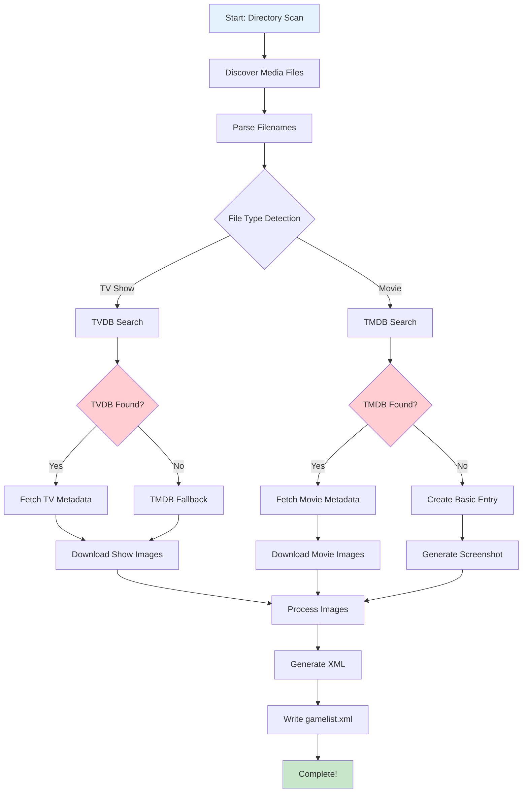

# Flow Assessment

Understanding how the MPV Scraper works and processes your media files.

## 🔄 Complete Workflow

```mermaid
flowchart TD
    A[Start: Directory Scan] --> B[Discover Media Files]
    B --> C[Parse Filenames]
    C --> D{File Type Detection}

    D -->|TV Show| E[TVDB Search]
    D -->|Movie| F[TMDB Search]

    E --> G{TVDB Found?}
    G -->|Yes| H[Fetch TV Metadata]
    G -->|No| I[TMDB Fallback]

    F --> J{TMDB Found?}
    J -->|Yes| K[Fetch Movie Metadata]
    J -->|No| L[Create Basic Entry]

    H --> M[Download Show Images]
    I --> M
    K --> N[Download Movie Images]
    L --> O[Generate Screenshot]

    M --> P[Process Images]
    N --> P
    O --> P

    P --> Q[Generate XML]
    Q --> R[Write gamelist.xml]
    R --> S[Complete!]

    style A fill:#e3f2fd
    style S fill:#c8e6c9
    style G fill:#ffcdd2
    style J fill:#ffcdd2
```

## 📁 Directory Structure Flow
