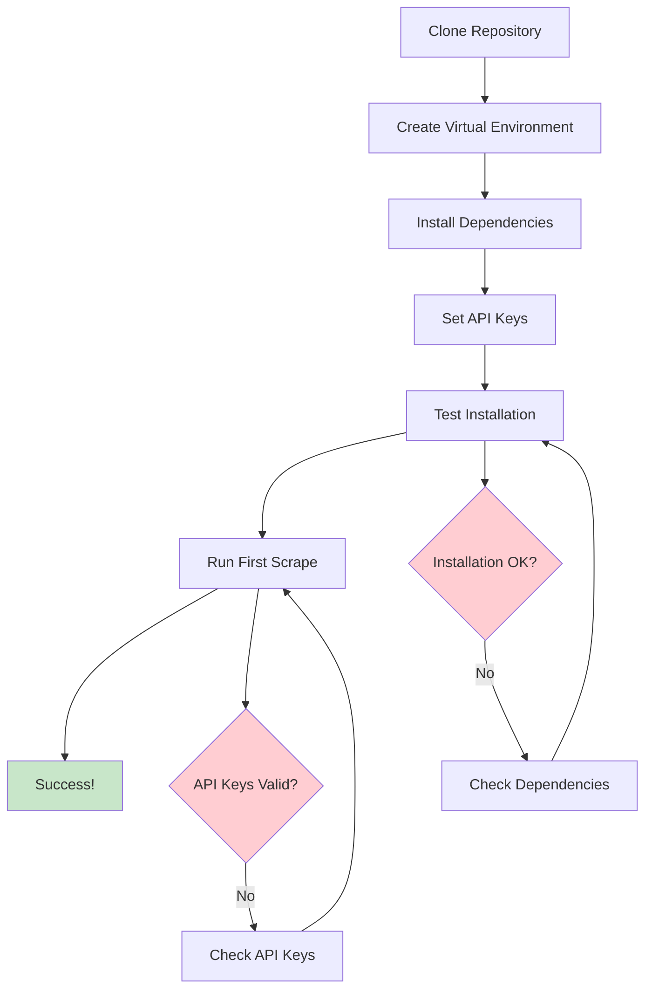

# Quick Start Guide

Welcome! This guide gets you scraping in minutes — no developer skills required.

What this tool does for you:
- Finds your TV shows and movies in a simple `/mpv` folder
- Grabs titles, descriptions, ratings, and images
- Generates EmulationStation-ready `gamelist.xml` files
- Can optimize videos for handhelds (optional)

If you don’t have paid API keys, don’t worry — you can use our free fallbacks.

## 🚀 Quick Start Flow



## Prerequisites

1. **Python 3.9+** (the project currently supports Python 3.9 or newer).
2. **TheTVDB** and **TheMovieDB** API keys.
   * Create free accounts and generate keys:
     * TVDB: <https://thetvdb.com/dashboard/api>
     * TMDB: <https://www.themoviedb.org/settings/api>
3. A media folder resembling:
   ```text
   /mpv
     ├── Movies/
     └── <Show Name>/
   ```

---

## Installation

```bash
# Clone the repo
git clone https://github.com/<your-username>/mpv-scraper.git
cd mpv-scraper

# Create and activate a virtual environment
python3 -m venv .venv
source .venv/bin/activate

# Install dependencies
pip install -r requirements.txt
```

---

## First‑run wizard (init)

Let the tool scaffold config and verify prerequisites for you:

```bash
python -m mpv_scraper.cli init /mpv
```

This will:
- Check `ffmpeg` and `ffprobe` availability and print versions
- Create `/mpv/images/` and `/mpv/Movies/` if missing
- Write `/mpv/mpv-scraper.toml` with sensible defaults
- Create `/mpv/.env.example` and `/mpv/.env` with empty API key placeholders

You can re-run safely; use `--force` to overwrite existing config.

Tip: After `init`, you’re ready to try scraping right away — even without keys — using fallbacks below.

### Config defaults
`mpv-scraper.toml` supports:
```toml
library_root = "/mpv"
workers = 0                 # 0 = auto-detect
preset = "handheld"        # or "compatibility"
replace_originals_default = false
regen_gamelist_default = false
```

When you omit CLI flags on `optimize-parallel`, these defaults are applied.

---

## Configure API Keys

Export your keys as environment variables **in the same shell session** where you will run the scraper:

```bash
export TVDB_API_KEY="YOUR_TVDB_API_KEY"
export TMDB_API_KEY="YOUR_TMDB_API_KEY"
```

You can add these lines to your shell profile (e.g., `~/.zshrc`) for persistence.

Notes:
- You can run without keys using fallbacks; see `docs/FALLBACKS.md`.

### No keys? Use fallbacks
If you don’t want to set up keys now:

```bash
# Use only free fallbacks (TVmaze/OMDb)
python -m mpv_scraper.cli scrape /mpv --fallback-only

# Prefer fallbacks, but allow primary providers too
python -m mpv_scraper.cli scrape /mpv --prefer-fallback

# Do an offline pass (no network): writes placeholders from cache
python -m mpv_scraper.cli scrape /mpv --no-remote
```

More details in `docs/FALLBACKS.md`.

---

## Reverting Changes

If you run the scraper and want to undo the filesystem changes it made, simply run:

```bash
python -m mpv_scraper.cli undo
```

The command consumes the generated `transaction.log` (created during a run) and restores the previous state.

---

## Artwork & Extended Metadata

All downloaded artwork is automatically saved as PNGs, including series/movie logo files used for the EmulationStation `<marquee>` tag.  If an image is wider than **500 px** or the file exceeds **600 KB**, the scraper resizes it proportionally and applies additional compression so it always meets EmulationStation performance recommendations.

### Folder Entries with Logos

The scraper now includes series logos (`marquee` field) in folder entries in the top-level `gamelist.xml`. This means that when browsing shows in EmulationStation, you'll see the series logo displayed alongside the poster image for each show folder.

## Error Handling & Resilience

The scraper includes robust error handling to ensure successful completion:

- **Automatic Retries:** Network downloads retry up to 3 times with exponential backoff
- **Placeholder Images:** If artwork downloads fail, transparent placeholder PNGs are created automatically
- **Graceful Degradation:** Missing artwork doesn't prevent metadata scraping or XML generation
- **Partial Success:** The scraper continues processing even if some operations fail

This means your scraping will complete successfully even with poor network conditions or missing artwork.

---

## Running the Scraper

The scraper provides several commands for different workflows:

### Full Workflow (Recommended)
```bash
python -m mpv_scraper.cli run /mpv
```

This performs the complete workflow:
1. **Scan** the directory for TV shows and movies
2. **Scrape** metadata and artwork from TVDB/TMDB
3. **Generate** EmulationStation-compatible `gamelist.xml` files

### Individual Commands
You can also run each step separately:

```bash
# Step 1: Scan directory (debug helper)
python -m mpv_scraper.cli scan /mpv

# Step 2: Scrape metadata and artwork
python -m mpv_scraper.cli scrape /mpv

# Step 3: Generate XML files
python -m mpv_scraper.cli generate /mpv
```

The scraper will prompt for ambiguous titles and automatically retry failed downloads.

---

## Advanced Scraping Features

### Incremental Scraping

By default, the scraper checks for already-scraped content and skips it to save time and API calls. This is especially useful when adding new episodes to existing shows or new movies to your library.

**How it works:**
- Checks for existing `.scrape_cache.json` files
- Verifies that episode/movie images exist
- Only scrapes new or missing content

**Force re-scrape everything:**
```bash
# Re-scrape all content, ignoring existing cache
python -m mpv_scraper.cli scrape /mpv --refresh
```

**Example workflow:**
```bash
# Initial scrape
python -m mpv_scraper.cli scrape /mpv

# Add new episodes to existing show
# ... copy new files ...

# Re-run scrape - only new episodes are processed
python -m mpv_scraper.cli scrape /mpv
```

### Interactive Resolution

When search fails or finds multiple ambiguous matches, you can enable interactive resolution to manually specify the correct API ID.

**Enable interactive mode:**
```bash
# Prompt for manual ID input on failures/ambiguity
python -m mpv_scraper.cli scrape /mpv --prompt-on-failure

# Shorthand version
python -m mpv_scraper.cli scrape /mpv --prof
```

**What happens:**
- On **ambiguous results**: Shows list of matches, you can select by number or provide API ID
- On **search failure**: Prompts for manual API ID input (e.g., `tvdb-70533` or `tmdb-15196`)
- **Skip option**: You can skip problematic items to continue the run
- **One retry**: If ID validation fails, you get one retry opportunity

**API ID format:**
- Accepts formats: `tvdb-70533`, `TVDB-70533`, `tvdb:70533` (case-insensitive)
- Supported providers: `tvdb`, `tmdb`, `omdb`, `tvmaze`, `anidb`, `fanarttv`
- Example: `tvdb-70533` for Twin Peaks, `tmdb-15196` for Clue (1985)

**Example:**
```bash
# Scrape with interactive resolution enabled
python -m mpv_scraper.cli scrape /mpv --prof

# When ambiguity occurs:
# ⚠️  Metadata lookup issue for: Twin Peaks
# Found multiple possible matches. Please choose one:
#   [1] Twin Peaks (1990) - ID: 70533
#   [2] Twin Peaks: The Return (2017) - ID: 12345
# Options:
#   - Enter a number (1-2) to select a match
#   - Enter an API ID (e.g., 'tvdb-70533' or 'tmdb-15196')
#   - Enter 'skip' to skip this item
# Your choice: 1
```

### Filename API Tags

You can embed API IDs directly in filenames to bypass search entirely and use direct lookup. This is the most accurate and fastest method.

**Format:**
- Place API tag at the end of filename: `{provider-id}`
- Example: `Twin Peaks - S01E01 - Pilot {tvdb-70533}.mp4`
- Example: `Clue (1985) {tmdb-15196}.mkv`

**Supported providers:**
- `{tvdb-XXXX}` - TVDB ID for TV shows
- `{tmdb-XXXX}` - TMDB ID for movies
- `{omdb-XXXX}` - OMDb ID for movies
- `{tvmaze-XXXX}` - TVmaze ID for TV shows
- Case-insensitive: `{TVDB-70533}` works the same as `{tvdb-70533}`

**Benefits:**
- **Faster**: Skips search entirely, uses direct API lookup
- **More accurate**: No ambiguity, exact match guaranteed
- **Fewer API calls**: Direct lookup is more efficient than search

**Example filenames:**
```text
# TV show with TVDB tag
Twin Peaks - S01E01 - Pilot {tvdb-70533}.mp4

# Movie with TMDB tag
Clue (1985) {tmdb-15196}.mkv

# Movie with OMDb tag
The Terminator (1984) {omdb-tt0088247}.mp4
```

**How it works:**
1. Parser extracts API tag from filename
2. Scraper detects tag before performing search
3. Uses direct API lookup with the ID
4. Falls back to search if direct lookup fails

**Note:** API tags are removed from the filename before title parsing, so they don't affect metadata extraction.

You should end up with a structure like:

```text
/mpv
  ├ gamelist.xml                # top-level
  ├ Movies/
  │   ├ gamelist.xml
  │   └ images/
  └ <Show Name>/
      ├ gamelist.xml
      └ images/
```

---

## Available Commands

The scraper provides these commands:

- **`scan`** - Discover shows and movies in a directory
- **`scrape`** - Download metadata and artwork from TVDB/TMDB
  - `--refresh` - Force re-scrape of all content
  - `--prompt-on-failure` / `--prof` - Interactive resolution for failures/ambiguity
  - `--prefer-fallback` - Prefer fallback providers (TVmaze/OMDb)
  - `--fallback-only` - Use only fallback providers
  - `--no-remote` - Offline mode (cache/placeholder only)
- **`generate`** - Create gamelist.xml files from scraped data
- **`run`** - Complete workflow (scan → scrape → generate)
- **`undo`** - Revert the last run using transaction.log
- **`sync-logos`** - Sync manually downloaded logos to gamelist.xml entries

All commands support the `--help` flag for detailed usage information.

### Manual Logo Management

The `sync-logos` command allows you to manually manage logo files and sync them to your gamelist.xml entries:

```bash
# Sync all logos in a directory
python -m mpv_scraper.cli sync-logos /mpv

# Sync logos for a specific show
python -m mpv_scraper.cli sync-logos /mpv --show "Darkwing Duck"

# Force update even if logo files don't exist
python -m mpv_scraper.cli sync-logos /mpv --force
```

**Naming Convention**: Place logo files in the `images/` directory with these names:
- `{show}-logo.png` - Main logo file
- `{show}-box.png` - Box art (alternative)
- `{show}-marquee.png` - Marquee display (alternative)

**Use Cases**:
- Manual logo downloads when automatic scraping fails
- Custom logo replacements
- Batch logo management for multiple shows

---

## Running the Test Suite

After installing dev dependencies you can execute all tests with:

```bash
pytest -q
```

Common filters:

* Only end-to-end pipeline: `pytest -k e2e`
* Only smoke tests: `pytest -k smoke`

Refer to [docs/TESTING.md](TESTING.md) for detailed guidance.

---

## Troubleshooting

* **Environment variable errors** – ensure `TVDB_API_KEY` and `TMDB_API_KEY` are exported.
* **Rate limiting** – the scraper respects API limits; if you scrape a large library, the run may pause briefly between requests.
* **Network failures** – the scraper automatically retries failed downloads; if you see placeholder images, some artwork downloads failed but processing continued.
* **Incorrect matches** – the CLI will prompt for ambiguous titles; re-run the scraper if you made a wrong selection.

### API Issues

For detailed help with TVDB and TMDB API authentication issues, see the [API Troubleshooting Guide](../technical/API_TROUBLESHOOTING.md).

Common API problems and quick fixes:
- **401 Unauthorized**: Check API key format and environment variables
- **Rate limiting**: Wait between large scraping operations
- **Network issues**: Verify internet connectivity and firewall settings

---

Happy scraping!
